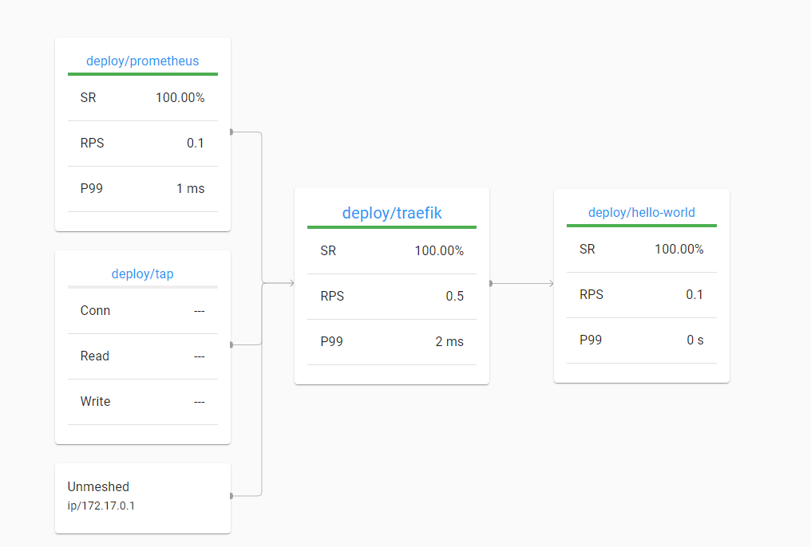

## Prerequisites

- Local kubernetes cluster like minikube kind, k3s, etc.
- [Docker](https://docs.docker.com/get-docker)
- [kubectl](https://kubernetes.io/docs/tasks/tools)
- [make](https://gnuwin32.sourceforge.net/packages/make.htm)
- [helm](https://helm.sh/docs/intro/install)

## Deployment

To simply begin deploying everything in order, enter the following command:
```sh
make install
```

## Exposing services

### Hello World ([http://localhost:8000](http://localhost:8000))
```sh
make hello
```
### Linkerd Dashboard ([http://localhost:8080](http://localhost:8080))

```sh
make dashboard
```
You may change the desired port values in the **Makefile**.

## Cleaning up

To clean up all resources:
```sh
make delete
```

## Notes
- The Traefik service uses *ClusterIP* by default to simplify the usage and experience. *LoadBalancer* was considered at first but then it will require several more steps to expose the service (e.g. minikube tunnel).
- Linkerd certificates were created using [step](https://smallstep.com/cli) as indicated in the [docs](https://linkerd.io/2.12/tasks/generate-certificates).